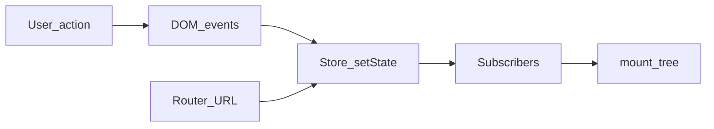

# Architecture and design principles

## Goals

- **Small surface area** — a handful of functions instead of a large runtime.
- **Plain JavaScript** — ESM modules, no compile step required inside `framework/`.
- **Explicit data flow** — store updates trigger subscribers; routing updates URL and store.
- **Developer-owned DOM policy** — `mount()` replaces the root’s children; you choose when to re-render.

## Module layout

| Module | Responsibility |
|--------|------------------|
| `dom.js` | Virtual nodes (`h`), mounting to the DOM, attributes/styles, event props (`onClick`, …). |
| `state.js` | `createStore` with `getState`, `setState`, `subscribe`. |
| `router.js` | `createRouter`, `navigate`, `popstate` integration. |
| `events.js` | Optional **delegation** helpers for listeners on a stable root. |
| `http.js` | Thin `fetch` wrappers for JSON-heavy APIs. |
| `index.js` | Public exports for `import { … } from 'dot-js'`. |

## Typical data flow

1. User interacts with the DOM (clicks, input).
2. Event handlers call `store.setState` or `navigate`.
3. Subscribers run `render()`, which calls `mount(parent, vnode)` to refresh the tree.

## Design trade-offs

- **Simplicity over batching** — this starter does not implement a diffing engine; full re-mounts are acceptable for learning apps.
- **Declarative event props** — handlers live in the vnode tree (`onClick`, `onInput`, …). On each `mount()` the old DOM (and its listeners) are replaced. If you want a “attach once” listener on a stable root, use event delegation.
- **Single active router** — `router.js` uses one global listener for the minimal API; replace with a scoped design if you outgrow it.
